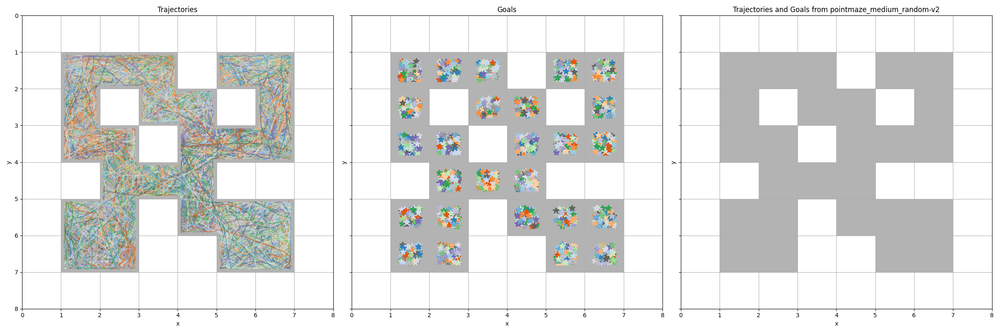

# Offline RL from random trajectories

This repository contains the code to train optimal policies from random trajectories using offline reinforcement learning.

For a brief overview see the [offline-rl-summary](assets/offline-rl-summary.md) document.

## Datasets

The data is collected from the [PointMaze](https://robotics.farama.org/envs/maze/point_maze/) environment, which contains an open arena with only perimeter walls. The agent uses a uniform random sampling or a PD controller (fetched from [here](https://minari.farama.org/datasets/D4RL/pointmaze/open-v2/)) to follow a path of waypoints generated with QIteration until it reaches the goal. The task is continuing which means that when the agent reaches the goal the environment generates a new random goal without resetting the location of the agent. The reward function is sparse, only returning a value of 1 if the goal is reached, otherwise 0. To add variance to the collected paths random noise is added to the actions taken by the agent.

#### Renderings
| Env | 100k | 1M | PD Controller |
| --- | ----------- | --------- | ----- |
| Open |  |  |  |
| Medium |  |  |  |
| Large |  |  |  |

## Results

The hyperparameters for the following results where obtained by running a hyperparameter sweep on the IQL algorithm using PointMaze_Open-v3 (episode=500) with the 100k random uniform dataset. The results are averaged over 10 episodes with consistent initialization.

### PointMaze_Open-v3 (episode=500)

| Algorithm | Dataset Size | Dataset Sampling | Eval Reward |
| --------- | ----- | ----- | ----- |
| Uniform Random | - | - |  0.1 |
| IQL | 100k | Uniform Random | 4.7 |
| IQL | 1M | Uniform Random | 8.0 |
| IQL | 10M | Uniform Random | 8.1 |
| IQL | 1M | PD Controller | 8.6 |

We can see that the random uniform baseline achieves a cummulative reward of 0.1, while the IQL algorithm achieves an max reward of 8.1 with 10M, 8.0 with 1M and 4.7 with 100k step which where sampled using the uniform random baseline. Thus the algorithm learns a approximate optimal policy from the from (very) suboptimal trajectories. We can also see that the PD controller achieves a max reward of 8.6 with 1M steps, which is better than the uniform random sampling.

#### Renderings
| Uniform Random | IQL 100k | IQL 1M |
| ----------- | --------- | ----- |
|  |  |  |

### PointMaze_Medium-v3 (episode=500)

Now we reused the _same_ hyperparameters but increased the difficulty of the environment by changing the maze to a medium size.

| Algorithm | Dataset Size | Dataset Sampling | Eval Reward |
| --------- | ----- | ----- | ----- |
| Uniform Random | - | - |  0.1 |
| IQL | 100k | Uniform Random | 0.1 |
| IQL | 1M | Uniform Random | 2.3|
| IQL | 10M | Uniform Random | 2.4 |
| IQL | 1M | PD Controller | 2.7 |

We can see that the max reward dropped significantly to 2.4 with 10M steps, 2.3 with 1M and 0.1 with 100k steps. But still the agent is able to find a path to the goal.


#### Renderings
When closely inspecting the renderings we can see that the agent sometimes struggles with the walls and gets stuck in a local minima. This is likely because the agent struggles with long term planning which is required due to the reward function.

| Uniform Random | IQL 100k | IQL 1M |
| ----------- | --------- | ----- |
|  |  |  |


### PointMaze_Large-v3 (episode=500)
To push the limits of the algorithm we increased the difficulty of the environment by changing the maze to a large size. We reused the _same_ hyperparameters as before.

| Algorithm | Dataset Size | Dataset Sampling | Eval Reward |
| --------- | ----- | ----- | ----- |
| Uniform Random | - | - |  0.0 |
| IQL | 100k | Uniform Random | 0.2 |
| IQL | 1M | Uniform Random |  0.4 |
| IQL | 10M | Uniform Random | 0.4 |
| IQL | 1M | PD Controller | 0.1 |

Because of the bad results, a new hyperparameter sweep was performed on the IQL algorithm using PointMaze_Large-v3 (episode=500) with the 1M random uniform dataset. Here the new results using the new hyperparameters:

| Algorithm | Dataset Size | Dataset Sampling | Eval Reward |
| --------- | ----- | ----- | ----- |
| Uniform Random | - | - |  TBD |
| IQL | 100k | Uniform Random | TBD |
| IQL | 1M | Uniform Random |  TBD |
| IQL | 10M | Uniform Random | TBD |
| IQL | 1M | PD Controller | TBD |


#### Renderings
Now the issues with the agent are very obvious in all cases. The agent is not able to find a path to the in most cases goal and gets stuck in local minima.

|Hyperparameters | Uniform Random | IQL 100k | IQL 1M |
| -- | ----------- | --------- | ----- |
| Reused |  |  |  |
| Rerun | | | |


## Setup
Install GNU make: https://www.gnu.org/software/make/.

Make sure that the default python interpreter is python >=3.10.

Setup env with
```
make setup
```

Further inspect CLI using 
```
make help
```