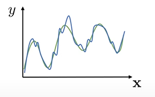

# 🧠 Offline Reinforcement Learning: A Modern Overview

## 🔍 Core Concepts

### Reinforcement Learning (RL) & Goal-Conditioned RL

- **Reinforcement Learning (RL)** involves an agent learning to make decisions by interacting with an environment to maximize cumulative rewards.
- **Goal-Conditioned RL (GCRL)** extends RL by conditioning the policy on a specific goal, enabling the agent to generalize across different tasks.

### Soft Actor-Critic (SAC)

- **SAC** is an off-policy RL algorithm that incorporates entropy regularization to encourage exploration by maximizing both reward and entropy.
- While effective in online settings, SAC can overestimate Q-values in offline scenarios due to distributional shift.

### Offline Reinforcement Learning

- **Offline RL** focuses on learning policies from a fixed dataset without further environment interaction, addressing scenarios where data collection is expensive or risky.
- Challenges include distributional shift and extrapolation errors when the learned policy encounters states or actions not well-represented in the dataset.
 - Good summary: https://www.youtube.com/watch?v=k08N5a0gG0A

### Distributional Shift
 - Lets say we fit a Q-function $y(x)$ which actually is not too bad (blue curve) to the true Q-function (green curve) using offline data. The fit will be bad for the regions where there is no data. If we now run inference we want to $\max_{a} y(x,a)$ which will actually return adversarial actions for the regions where we have no data. 

## 🛠️ Key Algorithms

### Implicit Q-Learning (IQL)
- Addresses the distributional shift by avoiding to ever evaluating the Q-function in the regions where we have no data. IQL is basically reweighted imitation learning.  
- **IQL** employs expectile regression and advantage-weighted behavior cloning, avoiding explicit policy optimization.
- Offers stability and effectiveness in various tasks, including AntMaze.

### Conservative Q-Learning (CQL)
 - Addresses the distributional shift by penalizing Q-values for actions not present in the dataset. This encourages conservative estimates to mitigate overestimation.
- **CQL** penalizes Q-values for actions not present in the dataset, promoting conservative estimates to mitigate overestimation.
- Demonstrates strong performance on benchmarks like AntMaze by avoiding risky extrapolations.

### Decision Transformer (DT) & Trajectory Transformer (TT)

- **Decision Transformer (DT)** treats RL as a sequence modeling problem, using transformers to predict actions conditioned on desired returns.
- **Trajectory Transformer (TT)** models the distribution of trajectories, enabling planning via beam search and bridging model-based planning with generative modeling.

## 🤖 Imitation Learning vs. Offline RL

- **Imitation Learning (IL)** directly mimics expert behavior but cannot surpass the demonstrator's performance.
- **Offline RL** can outperform the behavior policy by identifying and recombining high-reward trajectory segments.

## 🧩 Trajectory Composition

- Offline RL's ability to "stitch" together parts of suboptimal trajectories allows agents to achieve high-return outcomes not present in any single demonstration.

## 🦿 RT-1 & RT-2

- **RT-1** is trained on extensive robot demonstrations to perform diverse tasks using vision and instructions.
- **RT-2** enhances RT-1 by integrating Vision-Language Models (VLMs), improving generalization to unseen tasks.

## 🧠 π₀ Policy

- **π₀** is a generalist policy model trained using VLMs and flow-matching techniques on diverse robot datasets.
- Operates in a latent action space, enabling multimodal control across various robots and tasks.
- Trained entirely offline, π₀ serves as a foundation policy that can be fine-tuned for new tasks, analogous to GPT in NLP.

- Recent SOTA talk by S. Levine: https://www.youtube.com/watch?v=EYLdC3a0NHw 

## 🧪 Benchmarks: AntMaze

- **AntMaze** is a benchmark environment used to evaluate the performance of offline RL algorithms, particularly in tasks requiring navigation and goal-reaching behaviors.

## 📊 Summary Table

## 📊 Updated Summary Table

| Method               | Training Paradigm | Inference Paradigm | RL Fine-tuning Compatible | Key Feature                                                  | Uses VLM? |
|----------------------|-------------------|---------------------|----------------------------|---------------------------------------------------------------|-----------|
| **SAC**              | Online RL         | Model-free          | ✅                         | Entropy-regularized actor-critic algorithm                    | ❌        |
| **CQL**              | Offline RL        | Model-free          | ✅                         | Conservative Q-learning to penalize unseen actions            | ❌        |
| **IQL**              | Offline RL        | Model-free          | ✅                         | Implicit Q-learning via expectile regression + cloning        | ❌        |
| **Decision Transformer** | Imitation Learning (Return-conditioned) | Model-free (seq. decoding) | ⚠️ Limited                | Predicts actions with transformers conditioned on return      | ❌        |
| **Trajectory Transformer** | Offline RL       | Model-based (planning via beam search) | ⚠️ Yes (with planning)       | Models full trajectories and plans sequences via transformer  | ❌        |
| **RT-1 / RT-2**      | Imitation Learning | Model-free          | ⚠️ Not directly            | Vision-language robot policy trained from demos               | ✅ (RT-2) |
| **π₀**               | Imitation Learning | Model-free (latent policy) | ✅                         | Generalist latent policy trained via flow matching            | ✅        |

## 📚 References

- Levine, S., Kumar, A., Tucker, G., & Fu, J. (2020). [Offline Reinforcement Learning: Tutorial, Review, and Perspectives](https://arxiv.org/abs/2005.01643)
- Fujimoto, S., Meger, D., & Precup, D. (2019). [Off-Policy Deep Reinforcement Learning without Exploration](https://arxiv.org/abs/1812.02900)
- Kostrikov, I., Nachum, O., & Levine, S. (2021). [Offline Reinforcement Learning with Implicit Q-Learning](https://arxiv.org/abs/2110.06169)
- Chen, L., et al. (2021). [Decision Transformer: Reinforcement Learning via Sequence Modeling](https://arxiv.org/abs/2106.01345)
- Janner, M., Li, Q., & Levine, S. (2021). [Offline Reinforcement Learning as One Big Sequence Modeling Problem](https://arxiv.org/abs/2106.02039)
- Brohan, A., et al. (2022). [RT-1: Robotics Transformer for Real-World Control at Scale](https://arxiv.org/abs/2212.06817)
- Brohan, A., et al. (2023). [RT-2: Vision-Language-Action Models Transfer Web Knowledge to Robotic Control](https://arxiv.org/abs/2307.15818)
- Black, K., et al. (2024). [π₀: A Vision-Language-Action Flow Model for General Robot Control](https://www.physicalintelligence.company/download/pi0.pdf)

