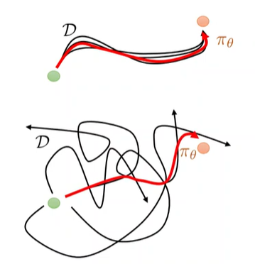
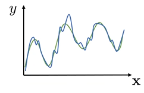
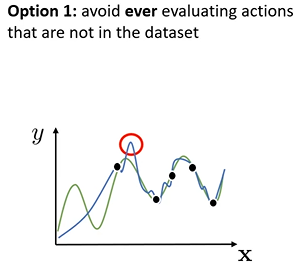
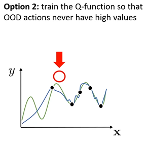
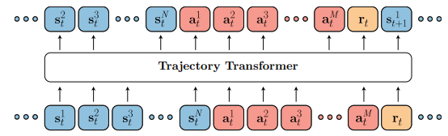
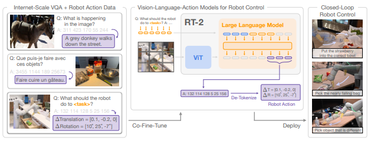
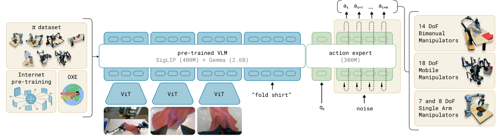

# 🧠 Offline Reinforcement Learning: A Modern Overview

## 🔍 Core Concepts

### Reinforcement Learning (RL) & Goal-Conditioned RL

- **Reinforcement Learning (RL)** involves an agent learning to make decisions by interacting with an environment to maximize cumulative rewards.
- **Goal-Conditioned RL (GCRL)** extends RL by conditioning the policy on a specific goal, enabling the agent to generalize across different tasks.

### Soft Actor-Critic (SAC)

- **SAC** is an off-policy RL algorithm that incorporates entropy regularization to encourage exploration by maximizing both reward and entropy.
- While effective in online settings, SAC can overestimate Q-values in offline scenarios due to distributional shift.

### Offline Reinforcement Learning

- **Offline RL** focuses on learning policies from a fixed dataset without further environment interaction, addressing scenarios where data collection is expensive or risky.
- Challenges include distributional shift and extrapolation errors when the learned policy encounters states or actions not well-represented in the dataset.

---

## 🤖 Imitation Learning vs. Offline RL

- **Imitation Learning (IL)** directly mimics expert behavior but cannot outperform it — it lacks reward optimization.
- **Offline RL** can discover higher-return behavior by combining segments from different demonstrations.

---

## 🧩 Trajectory Composition

- A key strength of offline RL is **stitching**: combining parts of suboptimal trajectories into new, higher-return paths.
- This enables solving tasks that are not solved by any single demonstration.

---

## ⚠️ Distributional Shift

- Let's say we fit a Q-function $y(x)$, which is a good approximation (blue curve) to the true Q-function (green curve) using offline data. The fit will be bad in regions without data.
- During inference, $\max_a y(x,a)$ may select adversarial actions in those unseen regions.

---

## 🛠️ Solutions to Distributional Shift

### Implicit Q-Learning (IQL)

- Addresses distributional shift by **avoiding Q-evaluation in unsupported regions**.
- Based on **expectile regression** and **advantage-weighted behavior cloning** — essentially reweighted imitation learning.
- Stable, performant on tasks like AntMaze.

---

### Conservative Q-Learning (CQL)

- Tackles distributional shift by **penalizing high Q-values for actions not present in the dataset**.
- Encourages conservative value estimates and avoids overestimation.
- Demonstrates strong performance on sparse-reward tasks like AntMaze.

---

## 🧠 Sequence Modeling Approaches

### Decision Transformer (DT)

- Treats RL as **sequence modeling**: predicts actions from a history of states and desired return.
- Trained via supervised learning, not RL — resembles return-conditioned imitation.

### Trajectory Transformer (TT)

- Models full **trajectory distributions** and uses **beam search** at inference to find high-return plans.
- Closer to model-based RL, with explicit planning in token space.

---

## 🤖 Real-World Generalist Models

### RT-1

- Trained on 130k real-world robot demonstrations.
- Uses vision and language inputs to perform diverse manipulation tasks.
- Trained fully offline using supervised imitation learning.

### RT-2

- Builds on RT-1 by integrating a **Vision-Language Model (VLM)** trained on web-scale data.
- Achieves better **zero-shot generalization** to unseen tasks and objects.

---

## 🧠 π₀ Policy

- A **generalist latent policy** trained with **flow-matching** on diverse multi-robot data.
- Integrates frozen VLMs to condition on vision and language.
- Trained offline via imitation, but **can be fine-tuned** for new tasks.
- Represents a **foundation policy** for robotics, analogous to GPT in NLP.

---

## 🧪 Benchmarks: AntMaze

- **AntMaze** is a standard benchmark to evaluate long-horizon, sparse-reward offline RL algorithms.
- Tasks require composing skills (e.g., go through hallway, then turn, then reach target).

---

## 📊 Summary Table

| Method               | Training Paradigm | Inference Paradigm         | RL Fine-tuning Compatible | Key Feature                                                   | Uses VLM? |
|----------------------|-------------------|-----------------------------|----------------------------|----------------------------------------------------------------|-----------|
| **SAC**              | Online RL         | Model-free                  | ✅                         | Entropy-regularized actor-critic                               | ❌        |
| **CQL**              | Offline RL        | Model-free                  | ✅                         | Penalizes Q-values for unseen actions                         | ❌        |
| **IQL**              | Offline RL        | Model-free                  | ✅                         | Expectile regression + advantage-weighted cloning             | ❌        |
| **Decision Transformer** | Imitation Learning (return-conditioned) | Model-free (seq. decoding) | ⚠️ Limited                | Sequence modeling conditioned on return                       | ❌        |
| **Trajectory Transformer** | Offline RL     | Model-based (beam search)   | ⚠️ Yes (with planning)      | Planning in token space from trajectory model                 | ❌        |
| **RT-1 / RT-2**      | Imitation Learning | Model-free                  | ⚠️ Not directly             | Real-world transformer policy from diverse robot demos        | ✅ (RT-2) |
| **π₀**               | Imitation Learning | Model-free (latent policy)  | ✅                         | Generalist latent policy trained with flow-matching and VLMs  | ✅        |

---

## 📚 References

- Levine, S., Kumar, A., Tucker, G., & Fu, J. (2020). [Offline Reinforcement Learning: Tutorial, Review, and Perspectives](https://arxiv.org/abs/2005.01643)
- Fujimoto, S., Meger, D., & Precup, D. (2019). [Off-Policy Deep Reinforcement Learning without Exploration](https://arxiv.org/abs/1812.02900)
- Kostrikov, I., Nachum, O., & Levine, S. (2021). [Offline Reinforcement Learning with Implicit Q-Learning](https://arxiv.org/abs/2110.06169)
- Chen, L., et al. (2021). [Decision Transformer: Reinforcement Learning via Sequence Modeling](https://arxiv.org/abs/2106.01345)
- Janner, M., Li, Q., & Levine, S. (2021). [Offline Reinforcement Learning as One Big Sequence Modeling Problem](https://arxiv.org/abs/2106.02039)
- Brohan, A., et al. (2022). [RT-1: Robotics Transformer for Real-World Control at Scale](https://arxiv.org/abs/2212.06817)
- Brohan, A., et al. (2023). [RT-2: Vision-Language-Action Models Transfer Web Knowledge to Robotic Control](https://arxiv.org/abs/2307.15818)
- Black, K., et al. (2024). [π₀: A Vision-Language-Action Flow Model for General Robot Control](https://www.physicalintelligence.company/download/pi0.pdf)
